<center><h1>2020-2021学年第2学期 实 验 报 告</h1></center>


<div style="margin-left:350px">- 课程名称：编程语言原理与编译</div>
<div style="margin-left:350px">- 实验项目：MicroC</div>
<div style="margin-left:350px">- 专业班级：计算机1803</div>
<div style="margin-left:350px">- 学生学号：31901061</div>
<div style="margin-left:350px">- 学生姓名：张泽峰</div>
<div style="margin-left:350px">- 实验指导教师: 郭鸣</div>


------


## 一、实验简介

​	本次大作业主要在原有工具Micro-C的基础上进行修改。通过对解释器和编译器的代码改进和开发，实现了部分C语言的语法。


## 二、项目自评等级（1-5）

|                  解释器                   | 完善度 |                        备注                        |
| :---------------------------------------: | :----: | :------------------------------------------------: |
|               注释 // /**/                |   5    |                   增加（**）注释                   |
| 字符串常量 单引号' ' 双引号 "" 三引号 ''' |   4    |                   没有实现三引号                   |
| 数值常量 0b0101， 八进制0o777 十六0xFFDA  |   5    | 给定二进制、八进制、十六进制数，转化为对应的十进制 |
|            switch case default            |   4    |                 只实现了int类型的                  |
|                  for循环                  |   5    |                    实现for循环                     |
|                 while循环                 |   5    |                   实现while循环                    |
|               do-while循环                |   5    |                  实现do-while循环                  |
|               do-until循环                |   5    |                  实现do-until循环                  |
|              新增类型 float               |   5    |             支持float类型的识别与输出              |
|               新增类型 char               |   5    |              支持char类型的识别与输出              |
|               新增类型 bool               |   5    |        支持bool类型(false\true)的定义与输出        |

|        编译器         | 完善程度 |             备注             |
| :-------------------: | :------: | :--------------------------: |
|       char类型        |    5     |                              |
|       float类型       |    5     |                              |
|     do-until循环      |    5     |                              |
|     do-while循环      |    5     |                              |
| switch  case  default |    5     |                              |
|        for循环        |    5     |                              |
|       三目运算        |    5     |                              |
|      += 等语法糖      |    5     |                              |
|   自增自减（++/--)    |    5     |                              |
|    修改Java虚拟机     |    5     | 支出了一条新的指令输出浮点数 |

## 三、项目说明

#### （一）结构

- 前端：由`F#`语言编写而成  
  - `CubyLex.fsl`生成的`CubyLex.fs`词法分析器。
  - `CubyPar.fsy`生成的`CubyPar.fs`语法分析器。
  - `AbstractSyntax.fs` 定义了抽象语法树
  - `Assembly.fs`定义了中间表示的生成指令集
  - `Compile.fs`将抽象语法树转化为中间表示
- 后端：由`Java`语言编写而成
- 测试集：测试程序放在`testing`文件夹内
- 库：`.net`支持
  - `FsLexYacc.Runtime.dll`


#### （二）文件架构

- src文件夹               Java虚拟机
- Absyn.fs                 抽象语法
- CLex.fsl          		fslex词法定义
- CPar.fsy             	fsyacc语法定义
- Parse.fs                 语法解析器
- Interp.fs                 解释器
- interpc.fsproj        项目文件
- Contcomp.fs         编译器
- Machine.fs            指令定义
- microcc.fsproj      编译器项目文件

#### （三）项目运行指令

- **解释器：**

  ```sh
  dotnet restore interpc.fsproj #可选
  dotnet clean interpc.fsproj #可选
  dotnet build interpc.fsproj #构建./bin/Debug/net6.0/interpc.exe，并查看详细生成过程
  ./bin/Debug/net6.0/interpc.exe zzf_program/test-float.c #查看运行结果
  dotnet "C:\Users\张泽峰\.nuget\packages\fslexyacc\10.2.0\build\/fslex/netcoreapp3.1\fslex.dll" -o "CLex.fs" --module CLex --unicode CLex.fsl #生成扫描器
  dotnet "C:\Users\张泽峰\.nuget\packages\fslexyacc\10.2.0\build\/fsyacc/netcoreapp3.1\fsyacc.dll" -o "CPar.fs" --module CPar CPar.fsy #生成分析器
  dotnet fsi #进入命令行
  									#注：以下代码在终端的fsi中运行
  #r "nuget: FsLexYacc";; //添加包引用
  #load "Absyn.fs" "Debug.fs" "CPar.fs" "CLex.fs" "Parse.fs" "Interp.fs" "ParseAndRun.fs" ;;
  open ParseAndRun;;
  fromFile "zyq_example/preinc.c";; #查看preinc.c语法树
  run (fromFile "zzf_program/test-float.c") [];; #解释执行preinc.c
  ```

- **编译器：**

  ```sh
  javac Machine.java#生成java虚拟机
  dotnet restore microc.fsproj #可选
  dotnet clean microc.fsproj #可选
  dotnet build microc.fsproj #构建./bin/Debug/net6.0/microc.exe
  	
  dotnet run --project microc.fsproj zzf_program/test-float.c  #执行编译器，编译.c文件，并输出 .out文件
  java Machine 测试的文件（.out)  参数 
  java Machinetrace zzf_program/test-float.out 0 #追踪查看运行栈
  ```

  

- **Java虚拟机：**

  ```sh
  javac Machine.java
  java Machine 测试的文件（.out)  参数 
  java Machinetrace 测试的文件 参数 //可以查看栈
  ```


## 四、功能实现

### 解释器

#### （一）增加 Float 类型

​	float：单精度浮点型，识别格式为'数字'+'.'+'数字'+'f(F)'，在栈中占一个地址单位

​	运行解释器会将float数值

- ​	抽象语法树

  ```sh
  type typ =
  	| TypF
  and expr =   
  | CstF of float32                  (* Constant float              *)
  ```

- 词法定义

  ```sh
  let keyword s =   
      match s with
      	| "float"   -> FLOAT
  规则
  rule Token = parse 
  	| ['0'-'9'] +'.'+['0'-'9'] + { CSTFLOAT (System.Single.Parse (lexemeAsString lexbuf)) }
  ```

- 语法定义

  ```sh
  //词元
  %token <float32> CSTFLOAT
  //优先级
  %token CHAR ELSE IF INT FLOAT NULL PRINT PRINTLN RETURN VOID WHILE
  //变量描述
  ConstFloat:
      CSTFLOAT                            { $1       }
    | MINUS CSTFLOAT                      { - $2     }
  ;
  ```

- 解释器

  ```sh
| CstF i -> ((float)i, store)
  ```

- 运行示例

  ```c
  void main()
  {
      float h;
      h = 12.5;
      print ("%f", h);
  }
  ```

  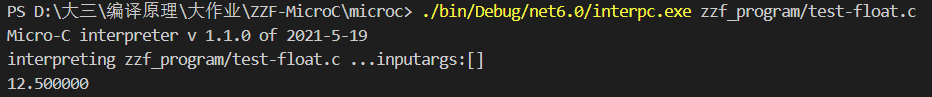


#### （二）增加 char类型

- 解释器

  ```sh
  | CstC i -> ((int32) (System.BitConverter.ToInt16(System.BitConverter.GetBytes(char (i)), 0)), store)
  ```

- 运行示例

  ```c
  int main()
  {
      char a;
      a = 'a';
      /*2131231*/
      print a;
      print("%c",a);
  }
  ```
  
  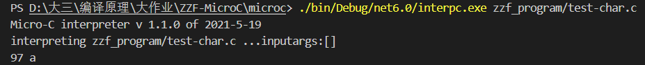


#### （三）增加bool类型

- 解释器

  ```fsharp
  | CstB i -> let res =
      			match i with
      			|true -> 1
      			|false ->0
         		(res,store)
  ```

- 运行示例

  ```c
  void main(){
    bool a;
    a = false;
    print a;
  }
  ```

  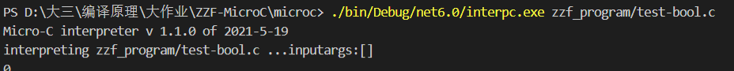

#### （四）进制转换

Clex.fs

- 转换函数

  ```sh
  // 2进制转换
  let toBinary value=
      let rec binaryToList value n =
          match value%10 with
          | _ when value%10 >= 0 && value%10 < 2 -> if value=0 then n else binaryToList (value/10) ((value%10)::n)
          | _        -> failwith "Does not conform to binary number type."
      let rec pow n =
          if n=0 then 1
          else 2 * (pow (n-1))
      let rec len xs =
          match xs with
          | []-> 0
          | x::xr->1 + len xr
      let rec eval (n: int list) =
          match n with
          | [] -> 0
          | xr::yr -> xr * pow (len yr) + eval yr
      eval (binaryToList value [])
  
  // 8进制转换
  let toOctal value=
      let rec octalToList value n =
          match value%10 with
          | _ when value%10 >= 0 && value%10 < 8 -> if value=0 then n else octalToList (value/10) ((value%10)::n)
          | _        -> failwith "Does not conform to octal number type."
      let rec pow n =
          if n=0 then 1
          else 8 * (pow (n-1))
      let rec len xs =
          match xs with
          | []-> 0
          | x::xr->1 + len xr
      let rec eval (n: int list) =
          match n with
          | [] -> 0
          | xr::yr -> xr * pow (len yr) + eval yr
      eval (octalToList value [])
  //16进制转换
  let toHex value = 
      let rec hexaToList (str:string)  = 
          if(str.Length <= 0) then []
          else
              match str.[0] with
              | _ when str.[0] >='a' && str.[0] <= 'f'    -> (int str.[0]) - ( int 'a') + 10::hexaToList str.[1..str.Length - 1]
              | _ when str.[0] >= 'A' && str.[0] <= 'F'   -> (int str.[0]) - ( int 'A') + 10::hexaToList str.[1..str.Length - 1]
              | _ when str.[0] >= '0' && str.[0] <= '9'   -> (int str.[0]) - ( int '0') ::hexaToList str.[1..str.Length - 1]
              | _                                         -> failwith "Does not conform to hex number type."
      let result = hexaToList (value)
      let mutable num = 0;
      List.iter(fun i -> num <- num*16 + i)result
      num
  ```

- rule规则

  ```sh
  | "0"['B''b']['0'-'1']+  { CSTINT (toBinary(System.Int32.Parse (binHexOct (lexemeAsString lexbuf))))}   
  | "0"['O''o']['0'-'7']+  { CSTINT (toOctal(System.Int32.Parse (binHexOct (lexemeAsString lexbuf))))}
  | "0"['X''x']['0'-'9''A'-'F''a'-'f']+  {CSTINT (hex2Dec(binHexOct (lexemeAsString lexbuf)))} 
  ```

- 运行示例

  ```c
  void main(){
    int a;
    a=0b1111;
    int b;
    b=0o117;
  
    print a;
    print b;
  }
  ```

  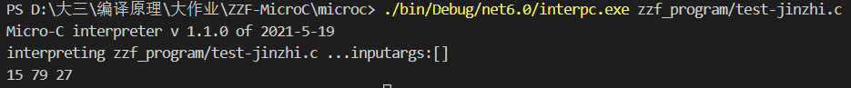


#### （五）自增自减（++a/a++/--a/a--）

- 语法树

  ```sh
  | PreInc of access                 (* ++i *)
  | PreDec of access                 (* --i *)                         
  | PostInc of access                (* i++ *)
  | PostDec of access                (* i-- *)
  ```

- 词法定义

  ```sh
  | "++"            { SELFINC }    //前置自增，后置自增
  | "--"            { SELFDEC }    //前置自减，后置自减
  ```

- 语法定义

  ```sh
  //词元
  %token SELFINC SELFDEC       //自增 自减
  //优先级
  %nonassoc NOT AMP SELFINC SELFDEC 
  ```

- 解释器

  ```sh
  | PreInc acc -> //前置自增
      let (loc, store1) as res = access acc locEnv gloEnv store 
      let res = getSto store1 loc 
      (res + 1, setSto store1 loc (res + 1)) 
  | PreDec acc -> //前置自减
      let (loc, store1) as res = access acc locEnv gloEnv store 
      let res = getSto store1 loc 
      (res - 1, setSto store1 loc (res - 1)) 
  | PostInc acc -> //后置自增
      let (loc, store1) as res = access acc locEnv gloEnv store 
      let res = getSto store1 loc 
      (res , setSto store1 loc (res + 1)) 
  | PostDec acc -> //后置自减
      let (loc, store1) as res = access acc locEnv gloEnv store 
      let res = getSto store1 loc 
      (res, setSto store1 loc (res - 1)) 
  ```

- 运行示例

  ```c
  void main(){
      int a;
      a = 3;
      print a++;
      a = 3;
      print ++a;
  
      a = 3;
      print a--;
      a = 3;
      print --a;
  }
  ```

  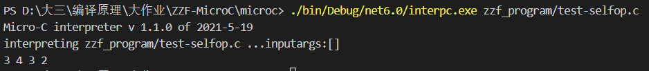


#### （六）doWhile/doUntil

- 抽象语法树

  ```sh
  and stmt =     
    | DoWhile of  stmt * expr          (* DoWhile loop                *)
    | DoUntil of stmt * expr           (* DoUntil loop                *)
  ```

- 词法定义

  ```sh
  | "do"      -> DO  
  | "dowhile" -> DOWHILE
  | "until"   -> UNTIL  
  | "dountil" -> DOUNTIL   
  ```

- 语法

  ```
  //词元
  %token  WHILE DO DOWHILE UNTIL DOUNTIL
  //用法
  StmtM:
    | DO StmtM WHILE LPAR Expr RPAR SEMI  { DoWhile($2, $5)      }
    | DO StmtM UNTIL LPAR Expr RPAR SEMI  { DoUntil($2, $5)      }
  ```

- 解释器

  ```sh
  | DoWhile(body,e) -> 
          let rec loop store1 =
                  //求值 循环条件,注意变更环境 store
              let (v, store2) = eval e locEnv gloEnv  store1
                  // 继续循环
              if v<>0 then 
                    loop (exec body locEnv gloEnv  store2)
              else store2  //退出循环返回 环境store2
        
          loop (exec body locEnv gloEnv  store)
  | DoUntil(body,e) -> 
          let rec loop store1 =
                let (v, store2) = eval e locEnv gloEnv  store1
                if v=0 then loop (exec body locEnv gloEnv   store2)
                      else store2    
          loop (exec body locEnv gloEnv  store)
  ```

- 运行示例

  ```c
  void main(){
      int n;
      n = 0;
      do
      {
          print n;
          n++;
      } while (n < 3);
  }
  
  void main() {
      int i;
      i=0;
     do{
       print ++i;
     }
     until(i>3);
  
  }
  ```

  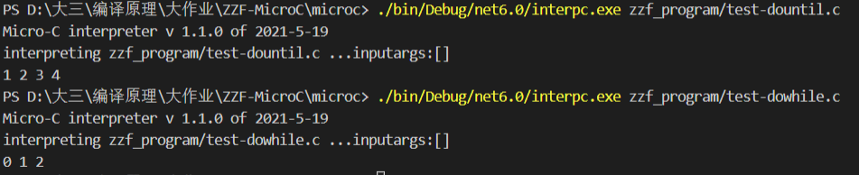

#### （七）switch-case

- 运行示例

  ```c
  void main(int n){
    int a;
    a=1;
    int b;
    b=2;
    switch (n){
      case 1:print a;
      case 2:print b;
      default:
        break;
    }
  }
  ```

  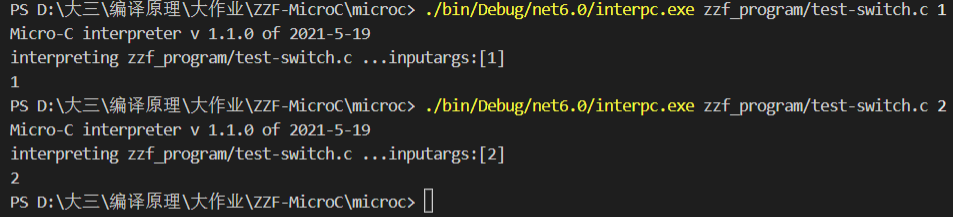

#### （八）for循环

- 解释器

  ```fsharp
      | For(e1,e2,e3,body) -> 
        let (res ,store0) = eval e1 locEnv gloEnv  store
        let rec loop store1 =
              //求值 循环条件,注意变更环境 store
            let (v, store2) = eval e2 locEnv gloEnv  store1
              // 继续循环
            if v<>0 then  
                          let (reend ,store3) = eval e3 locEnv gloEnv  (exec body locEnv gloEnv  store2)
                          loop store3
                        else store2  
        loop store0
  ```

- 运行示例

  ```
  void main(){
    int a;
    a = 0;
    for(a;a <= 3;a++){
      print a;
    }
  }
  ```

  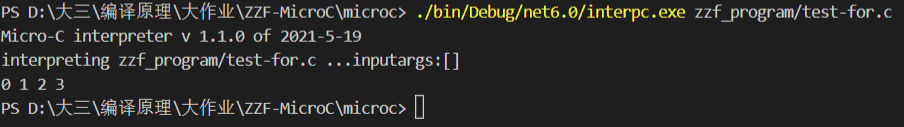


### 编译器

```sh
javac Machine.java#生成java虚拟机
dotnet restore microc.fsproj #可选
dotnet clean microc.fsproj #可选
dotnet build microc.fsproj #构建./bin/Debug/net6.0/microc.exe
	
dotnet run --project microc.fsproj zzf_program/test-float.c  #执行编译器，编译.c文件，并输出 .out文件
java Machine zzf_program_out/test-dowhile.out测试的文件（.out)  参数 
java Machinetrace zzf_program_out/test-float.out 0 #追踪查看运行栈
```

#### （一）dowhile

- 编译器

  ```fsharp
  | DoWhile (body, e) ->
          let labbegin = newLabel ()  //开始入口标签
          let labtest = newLabel ()   //循环体标签
          let labend = newLabel ()    //退出的标签
          let lablist = labend :: labtest :: lablist  //把
  
          [ Label labbegin ]      //begin开始
          @ cStmt body varEnv funEnv lablist  //编译body语句，返回汇编指令列表
            @ [ Label labtest ]               //test
              @ cExpr e varEnv funEnv lablist //执行表达式
                @ [ IFNZRO labbegin; Label labend ]     //如果条件！=0 继续循环   ||提交  end
  ```

- 运行示例

  ```c
  void main(){
      int n;
      n = 0;
      do
      {
          print n;
          n++;
      } while (n < 1);
  }
  ```

  编译运行out文件

  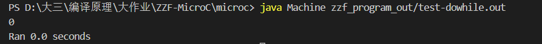

  编译成out后，查看追踪栈：

  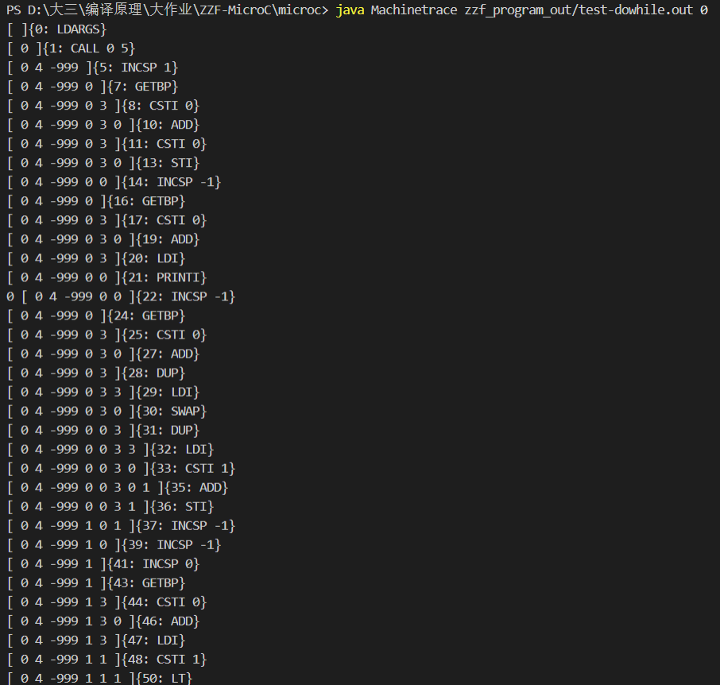

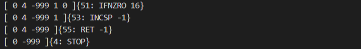

#### （二）for循环

- 编译器

  ```fsharp
  | For (dec, e, op, body) ->
          let labend = newLabel ()
          let labbegin = newLabel ()
          let labtest = newLabel ()
          let lablist = labend :: labtest :: lablist
  
          cExpr dec varEnv funEnv lablist
          @ [ INCSP -1; Label labbegin ]
            @ cStmt body varEnv funEnv lablist
              @ [ Label labtest ]
                @ cExpr op varEnv funEnv lablist
                  @ [ INCSP -1 ]
                    @ cExpr e varEnv funEnv lablist
                      @ [ IFNZRO labbegin ] @ [ Label labend ]
  ```

- 运行示例

  ```c
  void main(){
    int a;
    a = 0;
    for(a;a <= 3;a++){
      print a;
    }
  }
  ```

  编译运行out文件

  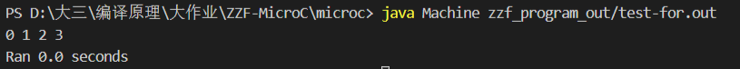

  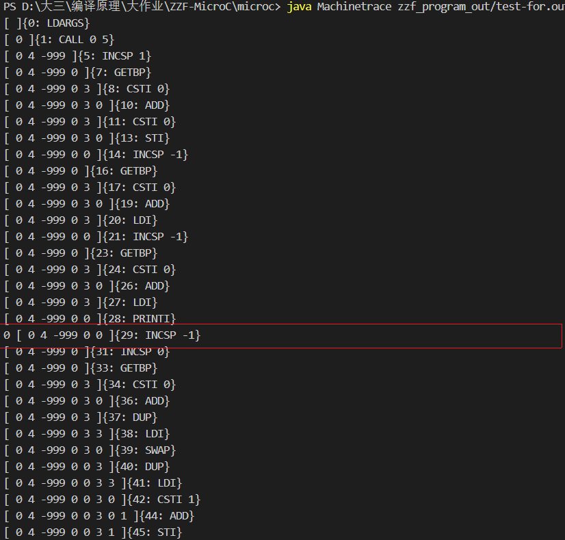

  

#### （三）自增自减

- 编译器

  ```fsharp
      //前置自增
      | PreInc acc -> 
          cAccess acc varEnv funEnv lablist
            @ [ DUP; LDI; CSTI 1; ADD; STI ]
      //前置自减
      | PreDec acc -> 
          cAccess acc varEnv funEnv  lablist
            @ [ DUP; LDI; CSTI 1; SUB; STI ]
      //后置自增
      | PostInc acc -> 
          cAccess acc varEnv funEnv lablist
            @ [ DUP; LDI; SWAP; DUP; LDI; CSTI 1; ADD; STI ; INCSP -1]
      //后置自减
      | PostDec acc -> 
          cAccess acc varEnv funEnv lablist
            @ [ DUP; LDI; SWAP; DUP; LDI; CSTI 1; SUB; STI ; INCSP -1]
  ```

- 运行示例

  ```c
  void main(){
      int a;
      a = 3;
      print a++;
      a = 3;
      print ++a;
  
      a = 3;
      print a--;
      a = 3;
      print --a;
  }
  ```

  编译运行.out文件

  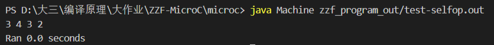

  


## 五、心得体会

- **项目总结**

  ​		microc的改进大作业由于难度大，我计划打算放在所有大作业最后动手，所以开始的时间已经是5月24日，由于欠缺f#相关知识储备，我在一开始阅读代码的时候感到非常的难受，代码段读不懂意思，也很难理解解释器，编译器的运行逻辑。在去复习了f#相关的知识，反复阅读microc的readme，且向同学不断取经学习之后，我花了足足5天的时间把解释器的逻辑大致理解，并且完善了部分功能。之后几天又通读编译器部分的代码，理解并实现了简单的几个功能。总体做下来，我扪心自问如果没有参考的示例代码和上一届学长的相助，我很难独自一人走完整个流程。对我来说，解释器比编译器好理解很多，完善的可操作性也高不少。

  ​		通过这一段时间夜以继日地忙活，我算是对整个编译器有了一些浅薄的理解，还需要后续的继续深入学习。但是不得不说，编译原理这门课是我大学以来最难的一门课，除了f#语言颠覆了我对c、java语言的运用理解之外，最后整个microC大作业也让我非常煎熬，一开始根本不知道该怎么做，哪怕是读了代码理解了运行逻辑之后，对于功能的完善也很难跨出第一步。

- **课程建议**

  ​		我个人感觉最后大作业的难度完全是基于对f#语言的理解掌握程度，所以希望老师平时上课的时候能够多讲讲f#的例题、每周的作业。

  ​		如果能适当降低大作业难度那就更好了。
