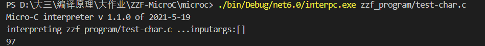

<center><h1>2020-2021学年第2学期 实 验 报 告</h1></center>


<div style="margin-left:350px">- 课程名称：编程语言原理与编译</div>
<div style="margin-left:350px">- 实验项目：MicroC</div>
<div style="margin-left:350px">- 专业班级：计算机1803</div>
<div style="margin-left:350px">- 学生学号：31901061</div>
<div style="margin-left:350px">- 学生姓名：张泽峰</div>
<div style="margin-left:350px">- 实验指导教师: 郭鸣</div>


------


## 一、实验简介

​	本次大作业主要在原有工具Micro-C的基础上进行修改。通过对解释器和编译器的代码改进和开发，实现了部分C语言的语法。


## 二、项目自评等级（1-5）

| 解释器                                    | 评分 | 备注                     |
| ----------------------------------------- | ---- | ------------------------ |
| 注释 // /**/                              | 5    |                          |
| 字符串常量 单引号' ' 双引号 "" 三引号 ''' | 3    |                          |
| 数值常量 0b0101， 八进制0o777 十六0xFFDA  | 5    |                          |
| if的多种方式 switch case                  | 5    |                          |
| 循环 for / while / do while/ until        | 4    | for循环没有实现          |
| 新增类型 float                            | 4    | 解释器输出float的ascii码 |
| 新增类型 char                             | 4    | 解释器输出char的ascii码  |
| 动态作用域，静态作用域                    |      |                          |
| 闭包支持                                  |      |                          |
| 模式匹配支持                              |      |                          |
| 中间代码生成 AST，四元式，三元式，llvm    |      |                          |
| 生成器 generator, yield                   |      |                          |

## 三、项目说明

#### （一）结构

- 前端：由`F#`语言编写而成  
  - `CubyLex.fsl`生成的`CubyLex.fs`词法分析器。
  - `CubyPar.fsy`生成的`CubyPar.fs`语法分析器。
  - `AbstractSyntax.fs` 定义了抽象语法树
  - `Assembly.fs`定义了中间表示的生成指令集
  - `Compile.fs`将抽象语法树转化为中间表示
- 后端：由`Java`语言编写而成
- 测试集：测试程序放在`testing`文件夹内
- 库：`.net`支持
  - `FsLexYacc.Runtime.dll`


#### （二）文件架构

- src文件夹               Java虚拟机
- Absyn.fs                 抽象语法
- CLex.fsl          		fslex词法定义
- CPar.fsy             	fsyacc语法定义
- Parse.fs                 语法解析器
- Interp.fs                 解释器
- interpc.fsproj        项目文件
- Contcomp.fs         编译器
- Machine.fs            指令定义
- microcc.fsproj      编译器项目文件

#### （三）项目运行指令

- **解释器：**

  ```sh
  dotnet restore interpc.fsproj #可选
  dotnet clean interpc.fsproj #可选
  dotnet build interpc.fsproj #构建./bin/Debug/net6.0/interpc.exe，并查看详细生成过程
  ./bin/Debug/net6.0/interpc.exe zzf_program/test-float.c #查看运行结果
  dotnet "C:\Users\张泽峰\.nuget\packages\fslexyacc\10.2.0\build\/fslex/netcoreapp3.1\fslex.dll" -o "CLex.fs" --module CLex --unicode CLex.fsl #生成扫描器
  dotnet "C:\Users\张泽峰\.nuget\packages\fslexyacc\10.2.0\build\/fsyacc/netcoreapp3.1\fsyacc.dll" -o "CPar.fs" --module CPar CPar.fsy #生成分析器
  dotnet fsi #进入命令行
  									#注：以下代码在终端的fsi中运行
  #r "nuget: FsLexYacc";; //添加包引用
  #load "Absyn.fs" "Debug.fs" "CPar.fs" "CLex.fs" "Parse.fs" "Interp.fs" "ParseAndRun.fs" ;;
  open ParseAndRun;;
  fromFile "zyq_example/preinc.c";; #查看preinc.c语法树
  run (fromFile "zzf_program/test-float.c") [];; #解释执行preinc.c
  ```

- **编译器：**

  ```sh
  gcc -o machine.exe machine.c #生成c虚拟机
  dotnet restore microc.fsproj #可选
  dotnet clean microc.fsproj #可选
  dotnet build microc.fsproj #构建./bin/Debug/net6.0/microc.exe
  dotnet run --project microc.fsproj zzf_program/test-float.c
  .\machine.exe -trace zzf_program/test-float.out 0 #追踪查看运行栈
  ```

  

- **Java虚拟机：**

  ```sh
  javac Machine.java
  java Machine 测试的文件（.out)  参数 
  java Machinetrace 测试的文件 参数 //可以查看栈
  ```


## 四、功能实现

#### （一）增加 Float 类型

**解释器**

​	float：单精度浮点型，识别格式为'数字'+'.'+'数字'+'f(F)'，在栈中占一个地址单位

​	运行解释器会将float数值

- ​	抽象语法树

  ```sh
  type typ =
  	| TypF
  and expr =   
  | CstF of float32                  (* Constant float              *)
  ```

- 词法定义

  ```sh
  let keyword s =   
      match s with
      	| "float"   -> FLOAT
  规则
  rule Token = parse 
  	| ['0'-'9'] +'.'+['0'-'9'] + { CSTFLOAT (System.Single.Parse (lexemeAsString lexbuf)) }
  ```

- 语法定义

  ```sh
  //词元
  %token <float32> CSTFLOAT
  //优先级
  %token CHAR ELSE IF INT FLOAT NULL PRINT PRINTLN RETURN VOID WHILE
  //变量描述
  ConstFloat:
      CSTFLOAT                            { $1       }
    | MINUS CSTFLOAT                      { - $2     }
  ;
  ```

- 解释器

  ```sh
| CstF i -> ((float)i, store)
  ```

- 运行示例

  ```c
  void main()
  {
      float h;
      h = 1.5;
      print h;
  }
  ```

  


#### （二）增加 char类型

**解释器**

- 解释器

  ```sh
  | CstC i -> ((int32) (System.BitConverter.ToInt16(System.BitConverter.GetBytes(char (i)), 0)), store)
  ```

- 运行示例

  ```c
  void main()
  {
      float h;
      h = 1.5;
      print h;
  }
  ```

  


#### （三）进制转换

Clex.fs

- 转换函数

  ```sh
  // 2进制转换
  let toBinary value=
      let rec binaryToList value n =
          match value%10 with
          | _ when value%10 >= 0 && value%10 < 2 -> if value=0 then n else binaryToList (value/10) ((value%10)::n)
          | _        -> failwith "Does not conform to binary number type."
      let rec pow n =
          if n=0 then 1
          else 2 * (pow (n-1))
      let rec len xs =
          match xs with
          | []-> 0
          | x::xr->1 + len xr
      let rec eval (n: int list) =
          match n with
          | [] -> 0
          | xr::yr -> xr * pow (len yr) + eval yr
      eval (binaryToList value [])
  
  // 8进制转换
  let toOctal value=
      let rec octalToList value n =
          match value%10 with
          | _ when value%10 >= 0 && value%10 < 8 -> if value=0 then n else octalToList (value/10) ((value%10)::n)
          | _        -> failwith "Does not conform to octal number type."
      let rec pow n =
          if n=0 then 1
          else 8 * (pow (n-1))
      let rec len xs =
          match xs with
          | []-> 0
          | x::xr->1 + len xr
      let rec eval (n: int list) =
          match n with
          | [] -> 0
          | xr::yr -> xr * pow (len yr) + eval yr
      eval (octalToList value [])
  //16进制转换
  let toHex value = 
      let rec hexaToList (str:string)  = 
          if(str.Length <= 0) then []
          else
              match str.[0] with
              | _ when str.[0] >='a' && str.[0] <= 'f'    -> (int str.[0]) - ( int 'a') + 10::hexaToList str.[1..str.Length - 1]
              | _ when str.[0] >= 'A' && str.[0] <= 'F'   -> (int str.[0]) - ( int 'A') + 10::hexaToList str.[1..str.Length - 1]
              | _ when str.[0] >= '0' && str.[0] <= '9'   -> (int str.[0]) - ( int '0') ::hexaToList str.[1..str.Length - 1]
              | _                                         -> failwith "Does not conform to hex number type."
      let result = hexaToList (value)
      let mutable num = 0;
      List.iter(fun i -> num <- num*16 + i)result
      num
  ```

- rule规则

  ```sh
  | "0"['B''b']['0'-'1']+  { CSTINT (toBinary(System.Int32.Parse (binHexOct (lexemeAsString lexbuf))))}   
  | "0"['O''o']['0'-'7']+  { CSTINT (toOctal(System.Int32.Parse (binHexOct (lexemeAsString lexbuf))))}
  | "0"['X''x']['0'-'9''A'-'F''a'-'f']+  {CSTINT (hex2Dec(binHexOct (lexemeAsString lexbuf)))} 
  ```

- 运行示例

  ```c
  void main(){
    int a;
    a=0b1111;
    int b;
    b=0o117;
  
    print a;
    print b;
  }
  ```

  


#### （四）自增自减（++a/a++/--a/a--）

- 语法树

  ```sh
  | PreInc of access                 (* ++i *)
  | PreDec of access                 (* --i *)                         
  | PostInc of access                (* i++ *)
  | PostDec of access                (* i-- *)
  ```

- 词法定义

  ```sh
  | "++"            { SELFINC }    //前置自增，后置自增
  | "--"            { SELFDEC }    //前置自减，后置自减
  ```

- 语法定义

  ```sh
  //词元
  %token SELFINC SELFDEC       //自增 自减
  //优先级
  %nonassoc NOT AMP SELFINC SELFDEC 
  ```

- 解释器

  ```sh
  | PreInc acc -> //前置自增
      let (loc, store1) as res = access acc locEnv gloEnv store 
      let res = getSto store1 loc 
      (res + 1, setSto store1 loc (res + 1)) 
  | PreDec acc -> //前置自减
      let (loc, store1) as res = access acc locEnv gloEnv store 
      let res = getSto store1 loc 
      (res - 1, setSto store1 loc (res - 1)) 
  | PostInc acc -> //后置自增
      let (loc, store1) as res = access acc locEnv gloEnv store 
      let res = getSto store1 loc 
      (res , setSto store1 loc (res + 1)) 
  | PostDec acc -> //后置自减
      let (loc, store1) as res = access acc locEnv gloEnv store 
      let res = getSto store1 loc 
      (res, setSto store1 loc (res - 1)) 
  ```

- 运行示例

  ```c
  void main(){
      int a;
      a = 3;
      print a++;
      a = 3;
      print ++a;
  
      a = 3;
      print a--;
      a = 3;
      print --a;
  }
  ```

  


#### （五）doWhile/doUntil

- 抽象语法树

  ```sh
  and stmt =     
    | DoWhile of  stmt * expr          (* DoWhile loop                *)
    | DoUntil of stmt * expr           (* DoUntil loop                *)
  ```

- 词法定义

  ```sh
  | "do"      -> DO  
  | "dowhile" -> DOWHILE
  | "until"   -> UNTIL  
  | "dountil" -> DOUNTIL   
  ```

- 语法

  ```
  //词元
  %token  WHILE DO DOWHILE UNTIL DOUNTIL
  //用法
  StmtM:
    | DO StmtM WHILE LPAR Expr RPAR SEMI  { DoWhile($2, $5)      }
    | DO StmtM UNTIL LPAR Expr RPAR SEMI  { DoUntil($2, $5)      }
  ```

- 解释器

  ```sh
  | DoWhile(body,e) -> 
          let rec loop store1 =
                  //求值 循环条件,注意变更环境 store
              let (v, store2) = eval e locEnv gloEnv  store1
                  // 继续循环
              if v<>0 then 
                    loop (exec body locEnv gloEnv  store2)
              else store2  //退出循环返回 环境store2
        
          loop (exec body locEnv gloEnv  store)
  | DoUntil(body,e) -> 
          let rec loop store1 =
                let (v, store2) = eval e locEnv gloEnv  store1
                if v=0 then loop (exec body locEnv gloEnv   store2)
                      else store2    
          loop (exec body locEnv gloEnv  store)
  ```

- 运行示例

  ```c
  void main(){
      int n;
      n = 0;
      do
      {
          print n;
          n++;
      } while (n < 3);
  }
  
  void main() {
      int i;
      i=0;
     do{
       print ++i;
     }
     until(i>3);
  
  }
  ```

  

#### （六）switch-case

- 运行示例

  ```c
  void main(int n){
    int a;
    a=1;
    int b;
    b=2;
    switch (n){
      case 1:print a;
      case 2:print b;
      default:
        break;
    }
  }
  ```

  

